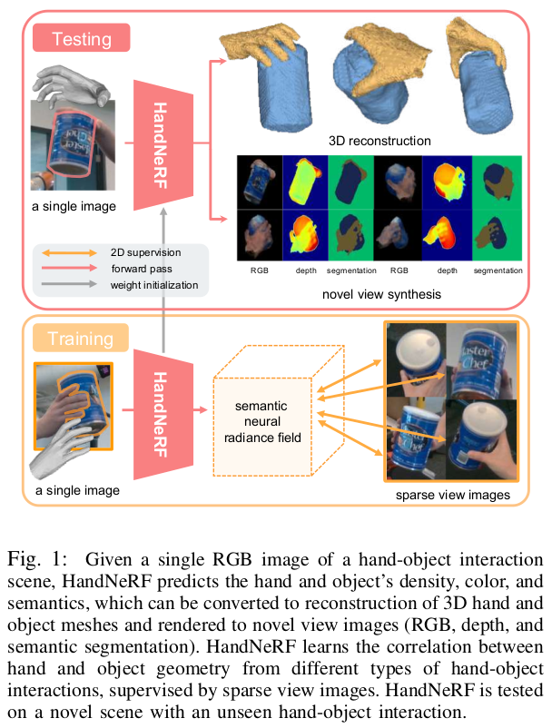
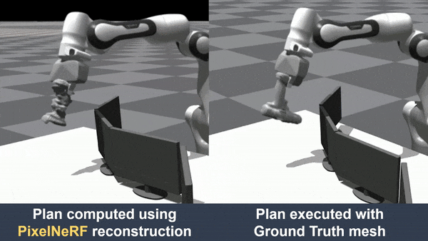
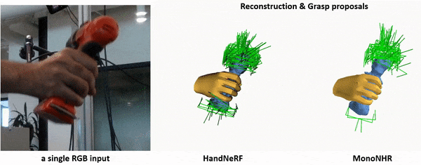
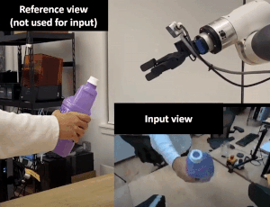
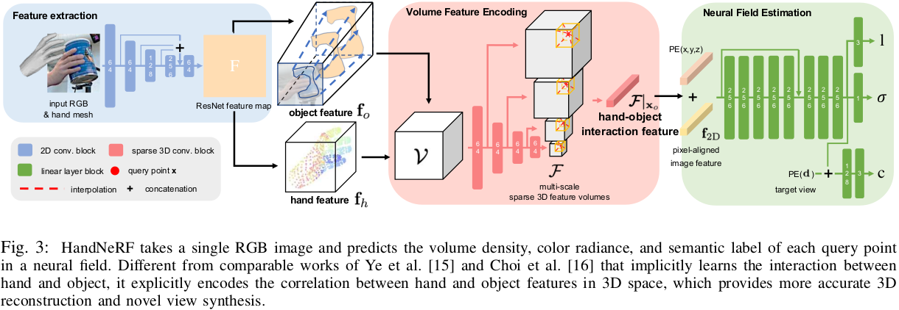

# HandNeRF: Learning to Reconstruct Hand-Object Interaction Scene from a Single RGB Image

<!--  -->
<table cellpadding="0" cellspacing="0" width="100%">
  <tr>
    <td>  </td>
    <td>  </td>
   </tr> 
   <tr>
    <td>  </td>
    <td>  </td>
  </tr>
</table>


# Introduction

This repository is the official [Pytorch](https://pytorch.org/) implementation of the preprint [HandNeRF: Learning to Reconstruct Hand-Object Interaction Scene from a Single RGB Image (ICRA 2024](https://arxiv.org/abs/2309.07891). Please refer to our [HOMEPAGE](https://samsunglabs.github.io/HandNeRF-project-page/) for more detail.

Given a single RGB image of a hand-object interaction scene, HandNeRF predicts the hand and object’s density, color, and semantics, which can be converted to reconstruction of 3D hand and object meshes and rendered to novel view images (RGB, depth, and semantic segmentation). HandNeRF learns the correlation between hand and object geometry from different types of hand-object interactions, supervised by sparse view images. HandNeRF is tested on a novel scene with an unseen hand-object interaction. We further demonstrated that object reconstruction from HandNeRF ensures more accurate execution of downstream tasks, such as grasping and motion planning for robotic hand-over and manipulation.

> Why do we use weak-supervision from sparse-view 2D images? 

Acquiring precise 3D object annotations from hand-object interaction scenes is challenging and labor-intensive, not to mention creating 3D CAD models for each object. Also, since the 3D ground truth itself contains sufficient information about hand-object interactions, it can readily supervise models regarding interaction priors, such as using contact information. Instead, we compare models utilizing weak-supervision from easily-obtained, cost-effective sparse-view images rather than 3D ground truth, to assess the efficacy of different approaches for encoding hand-object interaction correlations.


# Installation

- Clone this repository with the [HandOccNet](https://github.com/namepllet/HandOccNet) submodule by `git clone --recurse-submodules https://github.com/SamsungLabs/HandNeRF.git`. Or clone this repo and do `git submodule update --init --recursive`.
- We recommend you to use an [Anaconda](https://www.anaconda.com/) virtual environment.
- Install Python >= 3.7.16 and Pytorch >= 1.10.0. We used `torch==1.10.0+cu111 torchvision==0.11.0+cu111 torchaudio==0.10.0 -f https://download.pytorch.org/whl/torch_stable.html` in Ubuntu 20.04.
- Run `pip install -r requirements.txt`
- Download `MANO_LEFT.pkl` and `MANO_RIGHT.pkl` from [here](https://mano.is.tue.mpg.de/) (Download -> Models & Code) and place under the `tool/manopth/mano/models`.

# Pipeline



# Quick demo

- Download HandOccNet and HandNeRF model checkpoints from [here](https://drive.google.com/drive/folders/1AIYw8v8VlzlUk5dBEknYQQUq1DzVL29-?usp=sharing) and place under the `demo` folder.
- HandOccNet's hand estimation and the predicted hand's global location from the fitting process is used for HandNeRF's input.
- This HandNeRF's demo code runs the segmentation internally.
- Go to the `demo` folder and Run `python3 demo.py`
- You will find outputs in the `demo/output` folder.


# Directory

The cloned repository's directory structure should look like below.

### Root  

The `${ROOT}` is described as below.  

```  
${ROOT}  
|-- asset
|-- common  
|-- data  
|-- demo
|-- HandOccNet
|-- main  
|-- output  
|-- tool
```  

- `asset` contains config yaml files, markdown documents, and graphical figures.
- `common` contains network modules, rendering code, NeRF-related code, and so on.
- `data` contains dataloader and softlink to the datasets. We recommend you to put utilize softlinks to store dataset images.
- `HandOccNet` is the submodule for 3D hand mesh estimation, which is used as input to HandNeRF.
- `main` contains training and testing sripts of HandNeRF. Also, it has `config.py`, where you can set any parameters related to this project.
- `output` contains the current experiment's log, trained models, visualized outputs, and test results. We recommend you use a softlink for this directory as well. 
- `tool` contains preprocessing code and some high-level visualization related code. (Most visualization code is in `${ROOT}/common/utils/vis.py`.)

### Output  

Create the output folder as a softlink form (recommended) instead of a folder form because it would take large storage capacity.
The experiments' directory structure will be created as below.

```
${ROOT}  
|-- output  
|   |-- ${currrent_experiment_name} 
|   |   |-- log  
|   |   |-- checkpoint 
|   |   |-- result  
|   |   |-- vis  
```

- `log` folder contains training log file.
- `checkpoint` folder contains saved checkpoints for each epoch.
- `result` folder contains evaluation metric results.
- `vis` folder contains visualized results.

# Dataset preparation

Please refer to [here](./asset/doc/dataset.md).


# Running

We provide yaml config files to run HandNeRF, but you could also directly edit `${ROOT}/main/config.py`.


## Training

You can train HandNeRF as well as baselines.

### Ablation

Below are the models that we ablated in Table 1 in [our paper](https://arxiv.org/pdf/2309.07891.pdf).

```
M1: 'handmeshtransformerpixelnerf'  # Instead of 3DCNN for correlation, use transformer
M2: 'pixelnerf'  # no correlation process
M3: 'handmeshnnerf'  #  HandNeRF without pixel-aligned image feature
M4: 'noobjectpixelnerf' # Similar to MonoNHR, no explicit use of Object features
M5: 'handmeshpixelnerf' # Ours
```

Run the command below

```
python train.py --gpu 0 --cfg ../asset/yaml/dexycb_grasp.yml --nerf_mode semantic_handmeshpixelnerf_fine
```

You can set `--nerf_mode` with the model name you want to train. 
> Note:   
> ('semantic_' +) # Estimate the semantic label of each query point  
> (+ '_fine') # Do the hierachical sampling of NeRF


### SOTA comparison

Below are the models that we compared in Table 2 and 3 in [our paper](https://arxiv.org/pdf/2309.07891.pdf).

```
'pixelnerf' # PixelNeRF (https://alexyu.net/pixelnerf/) or M2
'handjointpixelnerf' # IHOINeRF; IHOI (https://github.com/JudyYe/ihoi) adapted to multi-view image supervision. it's not compatible with semantic_ ... 
'mononhrhandmeshpixelnerf' # MonoNHR (https://arxiv.org/abs/2210.00627) without mesh inpainter
'handmeshpixelnerf' # HandNeRF 
```

For Table 2 reproduction, run the command below

```
python train.py --gpu 0 --cfg ../asset/yaml/{dataset_name}_grasp.yml --nerf_mode semantic_handmeshpixelnerf_fine
```

For Table 3 reproduction, run the command below

```
python train.py --gpu 0 --cfg ../asset/yaml/dexycb_object.yml --nerf_mode semantic_handmeshpixelnerf_fine
```

You can set `--nerf_mode` with the model name you want to train. 
> Note:   
> ('semantic_' +) # Estimate the semantic label of each query point  
> (+ '_fine') # Do the hierachical sampling of NeRF


### Training on custom data

Run the command below

```
python train.py --gpu 0 --cfg ../asset/yaml/custom_grasp.yml --nerf_mode semantic_handmeshpixelnerf_fine
```

## Testing

You can evaluate and visualize outputs of HandNeRF as well as those of baselines.
__For reproduction, please refer to [this](https://docs.google.com/spreadsheets/d/1j1GBITu8uwzR9To2ANgrRY5k8z_DeX0SNb-y_wCMP8Y/edit?usp=sharing) first.__

### 3D mesh reconstruction

Evaluate the 3D reconstruction. We apply marching cube algorithm to the predicted semantic neural radiance field. F-scores and Chamfer Distance (CD) are measured on the reconstructed meshes.

```
python recon.py --gpu 0 --exp_dir ../output/{experiment name} --test_epoch {snapshot number} --cfg ../asset/yaml/{config yaml} --nerf_mode {model name}

# (Ex) python recon.py --gpu 0 --exp_dir ../output/exp_12-06_18:58 --test_epoch 100 --cfg ../asset/yaml/dexycb_grasp.yml --nerf_mode semantic_pixelnerf_fine
```

- During average evaluation, NaN is replaced with high dummy value (10).
- Add `--obj` argument to specify objects you want to evaluate. (Ex) `--obj 1,10`
- Add `--scene` argument to specify scene you want to evaluate. (Ex) `--scene ABF1_0000` for HO3D v3, `--scene 1_20201022_110947_000028` for DexYCB
- Edit the yaml file or `config.py` to save reconstructed meshes or use predict hand meshes as input.
- You can adjust `mesh_thr` and `mc_voxel_size`, which are related to applying marching cube algorithm to the predicted semantic neural radiance field.

### Novel view synthesis

Evaluate the novel view synthesis. PSNR, IoU, SSIM and LPIPS are measured. Depth is not numerically evaluated but you can visualize it.

```
python render_dataset.py --gpu 0 --exp_dir ../output/{experiment name} --test_epoch {snapshot number} --cfg ../asset/yaml/{config yaml} --nerf_mode {model name}

# (Ex) python render_dataset.py --gpu 0 --exp_dir ../output/exp_12-06_18:58 --test_epoch 100 --cfg ../asset/yaml/dexycb_grasp.yml --nerf_mode semantic_pixelnerf_fine
```

- During average evaluation, NaN is replaced with high dummy value (10).
- Add `--obj` argument to specify objects you want to evaluate. (Ex) `--obj 1,10`
- Add `--scene` argument to specify scene you want to evaluate. (Ex) `--scene ABF1_0000` for HO3D v3, `--scene 1_20201022_110947_000028` for DexYCB
- Edit the yaml file or `config.py` to save reconstructed meshes or use predict hand meshes as input.


###  360 degree rotation view

Renders the images from 360 degree rotating views. RGB, segmentation, and depth images are rendered. Specify the one scene you want to render.

```
python render_rotate.py --gpu 0 --exp_dir ../output/{experiment name} --test_epoch {snapshot number} --cfg ../asset/yaml/{config yaml} --nerf_mode {model name} --scene {scene identifier}

# (Ex) python render_rotate.py --gpu 0 --exp_dir ../output/exp_12-06_18:58 --test_epoch 100 --cfg ../asset/yaml/dexycb_grasp.yml --nerf_mode semantic_pixelnerf_fine --scene 1_20200918_113137_000030
```

If you want to make the images to a video, refer to `${ROOT}/tool/images2video.py`.

# Meta information

## Citation
If you find this work useful, please consider citing:

```
@InProceedings{choi2024handnerf,
  title={HandNeRF: Learning to Reconstruct Hand-Object Interaction Scene from a Single RGB Image},
  author={Choi, Hongsuk and Chavan-Dafle, Nikhil and Yuan, Jiacheng and Isler, Volkan and Park, Hyunsoo},
  booktitle={International Conference on Robotics and Automation},
  year={2024}
}
```
##  License

This project is licensed under the terms of CC-BY-NC 4.0.

## Related projects
[MonoNHR](https://arxiv.org/abs/2210.00627)  
[HandOccNet](https://github.com/namepllet/HandOccNet)    
[IHOI](https://github.com/JudyYe/ihoi)  
[Contact-GraspNet](https://github.com/NVlabs/contact_graspnet)  
[SMPLify-x](https://github.com/hongsukchoi/smplify-x)  
[Segment-Anything](https://github.com/facebookresearch/segment-anything)  
[OpenPose](https://github.com/CMU-Perceptual-Computing-Lab/openpose)  
[DexYCB](https://dex-ycb.github.io/)  
[HO3D](https://github.com/shreyashampali/ho3d)  
